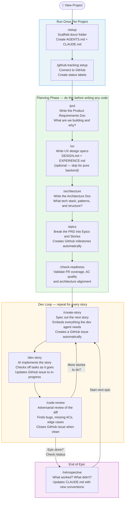
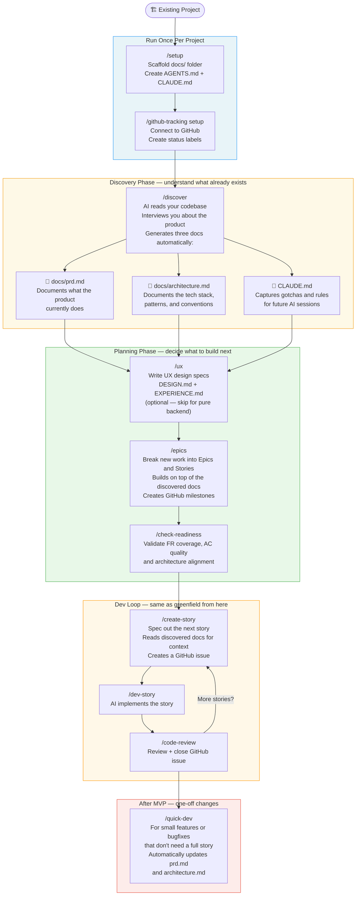
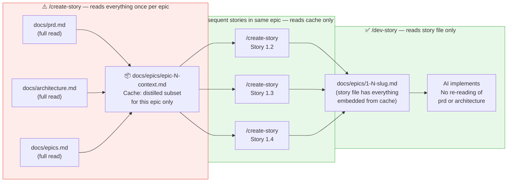

# bmad-lite-skills

A lean, token-efficient set of Claude Code skills for structured AI-assisted software development — designed to fit comfortably within Claude Pro's context budget while keeping the full value of the BMAD planning flywheel.

[](LICENSE)

---

## What this is

This is a standalone skills library for [Claude Code](https://claude.ai/code). It is a port and simplification of the [BMAD Method](https://github.com/bmad-method/bmad) — a structured approach to building software with AI that separates planning from implementation and keeps each AI session focused on one well-scoped task.

> **New to this?** BMAD is a way of using AI to build software in a structured, repeatable way.
> You write planning docs first, then AI helps you implement one small piece at a time.
> Each "skill" is a command you give Claude — like `/prd` to write requirements or `/dev-story` to write code.

**BMAD-LITE-SKILLS removes:**
- The activation ceremony that ran on every skill invocation (~700 tokens/call)
- Three-tier TOML customization infrastructure
- Agent persona overhead
- Sprint-status.yaml (replaced by GitHub issue labels)

**BMAD-LITE-SKILLS keeps:**
- The full planning flywheel: PRD → UX → Architecture → Epics → Stories → Dev → Review
- Epic context caching (~76% token reduction on `/create-story` after the first story)
- Inline code review (no separate session startup cost)
- GitHub issue + milestone tracking
- Security review, investigate, retrospective, correct-course

**BMAD-LITE-SKILLS adds:**
- `/ux` skill with Apple platform support (SwiftUI, HIG compliance checklist, multi-target cascade iPhone → iPad → Mac) and responsive web
- Epic-scoped retrospectives with output in `docs/epics/`
- BMAD migration flow (`/setup migrate` + `/setup clean`)
- Consolidated `docs/` layout — all artifacts under `docs/`, nothing at project root except `AGENTS.md` + `CLAUDE.md`
- Swift/Apple platform guidance system: `/setup` scaffolds `docs/setup/swift/` with sectioned best-practice reference docs (state management, concurrency, architecture, UI composition, testing, anti-patterns, plus iPadOS- and macOS-specific files); a 37-line guardrails block is appended to `CLAUDE.md`; `/dev-story` and `/code-review` read the relevant sections before acting
- `/refresh-swift` — researches current Swift/SwiftUI/platform patterns from primary sources (Hacking with Swift, Swift with Majid, SwiftLee, Apple WWDC docs, Point-Free) and updates both `docs/setup/swift/` and the skills repo stubs; offers to chain into `/swift-audit`
- `/swift-audit` — audits planning docs, story files, and Swift source code against `docs/setup/swift/` guidance; produces a triaged remediation file in `docs/maintainer/` ready for `/dev-story`
- **Web/SSG guidance system** (mirror of the Swift system): `/setup` scaffolds `docs/setup/web/` with sectioned reference docs (CSS design system, accessibility + SEO, anti-patterns, plus Astro- or Hugo-specific files) and appends a web guardrails block to `CLAUDE.md`; `/dev-story`, `/code-review`, and `/web-audit` read the relevant sections before acting
- `/refresh-web` — researches current web platform / CSS / Astro / Hugo patterns from primary sources (web.dev, MDN, Astro docs, Hugo docs, CSS-Tricks, Smashing, WAI) and updates `docs/setup/web/` + the skills repo stubs; offers to chain into `/web-audit`
- `/web-audit` — audits planning docs, story files, templates, styles, and markup against `docs/setup/web/` guidance and `docs/ux/DESIGN.md` tokens; produces a triaged remediation file in `docs/maintainer/` ready for `/dev-story`
- **Closed design loop**: `/create-story` extracts a per-story **Design Contract** (tokens, component specs, required states, reuse list) from `docs/ux/` into Dev Notes; `/dev-story` implements against it and runs `/design-verify` (build + screenshots, light/dark, Dynamic Type / responsive widths) before review; `/code-review` runs a Design Compliance pass and maintains a `docs/ux/components-built.md` inventory so later stories reuse components instead of reinventing them; `/check-readiness` blocks UI stories that have no design coverage
- `/ux` content-site (SSG) preset for Astro/Hugo sites — typography-first tokens, content-model → layout mapping, and a performance budget (Core Web Vitals + per-page JS budget) decided at design time
- **Subagent delegation via `/story-flywheel`**: spawns isolated `bmad-story-creator`, `bmad-story-developer`, and `bmad-story-reviewer` agents — each phase runs in its own context window so heavy reads (PRD, architecture, story files) never accumulate in the main thread
- **Deterministic guardrail hooks** (zero model tokens): `guard-secrets.sh` blocks hardcoded secrets at write time; `guard-design-tokens.sh` warns on off-token colors; `log-activity.sh` streams tool-call telemetry to `docs/metrics/activity.jsonl`; wired via `.claude/hooks/` by `/setup`
- **Observability ledger** (`docs/metrics/flywheel-ledger.jsonl`): each `/dev-story` and `/code-review` pass appends a structured line (story, model, build result, evals pass rate, finding counts) — queryable with `jq` to track per-story quality and model cost over time
- **Cumulative eval regression net** (`docs/evals/`): `/create-story` seeds `type: command` eval cases from ACs; `/dev-story` runs them (zero-token shell execution) and enables the case when the test lands; a failing eval on a later story is a regression and blocks close just like a red build
- `/upgrade-project` — detection-based sync for existing projects: scans for missing hooks, stubs, evals/metrics dirs, and CLAUDE.md sections; classifies each item as ADD / REFRESH / CONFLICT / OK; previews before applying; never overwrites locally edited content; writes `.bmad-lite/manifest.json` for future runs

---

## Credit

This project is derived from and inspired by **[BMAD Method](https://github.com/bmad-method/bmad)** by BMad Code, LLC, used under the [MIT License](https://github.com/bmad-method/bmad/blob/main/LICENSE). The BMAD Method is a structured AI development workflow; this project ports its core planning flywheel into a leaner form optimized for Claude Pro's context budget.

BMad™ and BMad Method™ are trademarks of BMad Code, LLC. This project is not affiliated with or endorsed by BMad Code, LLC.

---

## How to use

These skills are designed to be **added to any Claude Code session as a workspace directory** — not copied into individual projects. Clone this repo once and reference it across all your projects.

### 1 — Clone once

```bash
git clone https://github.com/rterakedis/bmad-lite-skills ~/repos/bmad-lite-skills
```

Put it wherever you keep shared tools. The path doesn't matter as long as it's consistent.

### 2 — Add to your Claude Code session

At the start of any session, run:

```
/add-dir ~/repos/bmad-lite-skills
```

Claude can now read all skill files from that directory alongside your project.

### 3 — Wire up auto-loading (recommended)

To avoid running `/add-dir` manually every session, add it as a startup hook in your project's `.claude/settings.json`:

```json
{
  "hooks": {
    "startup": [
      "add-dir ~/repos/bmad-lite-skills"
    ]
  }
}
```

The `/setup` skill writes this hook for you when initializing a new project — just tell it where you cloned this repo.

### 4 — Invoke skills

Once the directory is added, invoke skills by name:

| Skill | What it does |
|---|---|
| `/setup` | Scaffold `docs/`, write `AGENTS.md` + `CLAUDE.md`, wire up auto-`/add-dir` hook; for Apple platform projects, scaffolds `docs/setup/swift/` with platform-appropriate guidance files |
| `/prd` | Create, update, or validate the Product Requirements Doc |
| `/ux` | Create UX design specs — responsive web + Apple platforms (SwiftUI + HIG) |
| `/architecture` | Create or update the architecture document |
| `/epics` | Break the PRD into epics and stories, create GitHub milestones |
| `/check-readiness` | Validate PRD + architecture + epics are aligned before coding |
| `/create-story` | Spec the next story with full dev context embedded |
| `/dev-story` | Implement a story — reads relevant `docs/setup/swift/` files first on Apple projects; code review runs inline at the end |
| `/code-review` | Standalone adversarial review — reads Swift anti-patterns and state-management guidance on Apple projects |
| `/quick-dev` | One-off feature or fix without the full epic/story workflow |
| `/correct-course` | Handle mid-epic requirement changes or discovered bugs |
| `/investigate` | Start or resume a structured investigation case file |
| `/security-review` | OWASP + LLM security sweep, auto-schedules findings |
| `/status` | Show epic + story progress via GitHub milestones |
| `/retrospective` | Epic retrospective — 7 questions, updates `CLAUDE.md` |
| `/deferred` | View the deferred items log |
| `/refresh-swift` | Research current Swift/SwiftUI/platform best practices and update `docs/setup/swift/` + skills repo stubs; offers to chain into `/swift-audit` |
| `/swift-audit` | Audit planning docs, stories, and Swift source against `docs/setup/swift/`; writes a triaged remediation file to `docs/maintainer/` |
| `/refresh-web` | Research current web platform / CSS / Astro / Hugo best practices and update `docs/setup/web/` + skills repo stubs; offers to chain into `/web-audit` |
| `/web-audit` | Audit planning docs, stories, templates, styles, and markup against `docs/setup/web/` + DESIGN.md tokens; writes a triaged remediation file to `docs/maintainer/` |
| `/design-verify` | Render changed UI (simulator or dev server + screenshots) and compare against the design contract; runs inline at the end of `/dev-story` for UI stories |
| `/github-tracking setup` | One-time GitHub auth + create status labels |
| `/github-tracking backfill` | Retroactively create GitHub issues for existing stories |
| `/story-flywheel` | Automated create → dev → review loop using isolated subagents; each phase runs in its own context with automatic model routing (Opus for Swift dev, Sonnet elsewhere) |
| `/evals` | Build, run, and score the cumulative eval regression net for a story's epic — zero-token shell execution of accumulated `type: command` cases |
| `/upgrade-project` | Sync an existing project to the latest hooks, stubs, evals/metrics dirs, and CLAUDE.md sections — previews plan before applying, never clobbers local edits |
| `/discover` | Brownfield: reverse-engineer a codebase into docs |
| `/setup migrate` | Migrate a full-BMAD project to BMAD-LITE layout |
| `/setup clean` | Remove BMAD infrastructure after migration |

See [All Skills](#all-skills) below for full details on sub-parameters and behavior.

---

## Keeping skills up to date

```bash
cd ~/repos/bmad-lite-skills
git pull
```

All projects that reference this directory pick up the update immediately — nothing to copy or sync per project.

---

## Greenfield Process
*Use this when starting a brand-new project from scratch.*



---

## Brownfield Process
*Use this when you already have an existing codebase and want to start using this workflow.*



---

## Migrating from Full BMAD to BMAD-LITE

If you have an existing project using full BMAD (identifiable by a `_bmad/` directory at the project root), use the two-step migration flow rather than starting fresh.

### Step 1 — `/setup migrate`

Non-destructive. Reads `_bmad/config.toml` to find where BMAD stored its artifacts, then moves everything into the BMAD-LITE `docs/` layout:

| BMAD artifact | BMAD-LITE destination |
|---|---|
| `{planning_artifacts}/prd.md` | `docs/prd.md` |
| `{planning_artifacts}/architecture.md` | `docs/architecture.md` |
| `{planning_artifacts}/epics.md` | `docs/epics.md` |
| `{planning_artifacts}/*ux*.md` | `docs/ux/DESIGN.md` / `docs/ux/EXPERIENCE.md` |
| Other planning docs | `docs/project/` |
| `{stories_path}/*.md` | `docs/epics/` |
| `sprint-status.yaml` | Archived to `docs/project/sprint-status-archive.yaml`; status values stamped into each story file's `Status:` frontmatter field (keyed by filename stem) so backfill labels issues correctly |

`AGENTS.md` and `CLAUDE.md` are updated to add any BMAD-LITE sections that are missing; existing content is never replaced.

After the file moves, migrate attempts GitHub label setup and issue backfill inline — if `gh auth` passes, no manual tracking steps are needed. If auth isn't configured, migrate reports what to run manually.

### Step 2 — `/setup clean`

Destructive, but confirms before each target. Run only after verifying migrate succeeded.

Offers to delete three things independently:
- `_bmad/` — BMAD config, scripts, and customization files
- `sprint-status.yaml` — safe to delete since migrate archived a copy
- `src/bmm-skills/` — the original BMAD skill source; BMAD-LITE's `skills/` is the replacement

Each deletion requires explicit `y` confirmation. Tip: review with `git status` before committing the removals.

### Why two steps?

Migrate and clean are intentionally separate so you can verify the layout looks right before removing anything. If the migration output looks wrong, nothing has been deleted yet — you can correct and re-run migrate (it skips files that already exist at the destination).

The full happy-path migration is therefore just two commands:

```
/setup migrate    → moves files, stamps statuses, creates GitHub labels + issues
/setup clean      → removes _bmad/, sprint-status.yaml, src/bmm-skills/ (with confirmation)
```

---

## How the Token Budget Works
*Why this is cheaper than full BMAD — and how the cache makes it even cheaper.*



> **The key insight:** You pay the full reading cost once (when creating the first story in an epic).
> Every story after that uses the cache. The `/dev-story` agent only ever reads the story file —
> never the PRD or architecture doc — because `/create-story` embedded everything it needs.

---

## Feeding Project Knowledge Into the PRD and Architecture

Before running `/prd` or `/architecture`, you may already have useful material — a product brief you wrote in Google Docs, competitive research, API vendor documentation, stakeholder meeting notes, prior architectural decisions. This section explains how to get that content in front of Claude.

### Option 1 — Local files in `docs/project/` (recommended)

Create a `docs/project/` folder and drop any upstream inputs there before running `/prd` or `/architecture`. Both skills check this folder automatically on activation and read everything in it.

```
docs/project/
  brief.md              ← product vision, stakeholder requirements
  research.md           ← competitive analysis, user research
  api-vendor-notes.md   ← third-party API docs or constraints
  prior-adr.md          ← architecture decisions already made
  meeting-notes.md      ← anything from planning sessions
```

Any format works — `.md`, `.txt`, even a raw paste saved as a file. Claude reads them all and uses them to pre-populate the PRD brain dump or architecture tech stack discussion. You won't be asked to re-explain what's already there.

**This is also the right place for iterative notes.** If you've been drafting ideas in a separate Claude chat, copy the useful output into a file in `docs/project/` before starting the formal skill run.

### When upstream inputs change mid-project

If you update a file in `docs/project/` after implementation has already started, the flow is:

1. Update the file in `docs/project/`
2. Run `/prd update` — it reads the changed file, updates `docs/prd.md`, then scans `docs/epics/` for any `in-progress` or `done` stories written against the old PRD
3. If affected stories exist, run `/correct-course` — it updates downstream docs and schedules any remediation work as new stories in the right epic

`/correct-course` does **not** re-scan `docs/project/` itself. The trigger is always a known change you've already identified — the `/prd` or `/architecture` update flow surfaces the downstream impact.

### Option 2 — MCP-connected sources (Google Drive, Notion, etc.)

If you have an MCP server connected (Google Drive, Notion, Confluence, etc.), fetch the relevant documents **at the start of the session, before invoking the skill**:

1. Open a new Claude Code session.
2. Ask Claude to fetch the document via MCP: *"Read my product brief from Google Drive at [file name or URL]."*
3. Once Claude confirms it has the content, run `/prd` or `/architecture` in the same session — the fetched content is already in context.

Alternatively, download the file locally and save it to `docs/project/` — then it's persistent across sessions and doesn't require re-fetching each time.

> **Prefer `docs/project/` over re-fetching via MCP each session.** MCP fetches cost tokens every time and require the external service to be available. A local copy in `docs/project/` is free to re-read and works offline.

### Option 3 — Paste directly into the session

For one-off content that doesn't need to persist, paste it into the chat before running the skill:

*"Here's the product brief from our planning doc: [paste]. Now run `/prd`."*

Claude will use it for that session. It won't be available in future sessions unless you save it to `docs/project/`.

### What belongs in `docs/project/` vs `docs/prd.md`

| `docs/project/` | `docs/prd.md` |
|-----------------|---------------|
| Raw inputs — briefs, research, notes, exports | Distilled output — the canonical PRD |
| Written by humans, messy is fine | Written by `/prd`, structured |
| Read once during PRD/arch creation | Read every time the first story of a new epic is created |
| Never auto-generated or overwritten | Updated by `/prd` update flow and `/correct-course` |

Don't put everything into the PRD. Keep raw inputs in `docs/project/` so the PRD stays dense and implementation-focused.

---

## Session Hygiene — Start Fresh Between Phases

Context accumulates silently. If you run `/prd` → `/architecture` → `/epics` → `/create-story` all in one session, the PRD sits in context for every subsequent message — even when only the cache is needed.

**Rule: start a new Claude Code session for each major phase.**

| Phase | What to do |
|-------|-----------|
| After `/prd` is approved | End session. New session for `/architecture`. |
| After `/architecture` is approved | End session. New session for `/epics`. |
| After `/epics` is written | End session. New session for `/create-story`. |
| Each story | One session per story: `/create-story` → `/dev-story` (code-review runs inline at the end). |
| After each story is done | End session before starting the next story. |

**Mid-session:** If a `/dev-story` session is running long, use `/compact` after finishing a major task group (e.g., all backend work done, about to start frontend). This summarizes and compresses prior context without losing your place.

---

## Project File Layout

```
your-project/
├── AGENTS.md              ← AI conventions for all tools (Copilot, Cursor, Claude)
├── CLAUDE.md              ← Claude-specific rules and project conventions
├── .bmad-lite/
│   └── manifest.json      ← scaffold record (skills_path, surfaces, asset flags); written by /setup and /upgrade-project
├── .claude/
│   ├── settings.json      ← startup hook (add-dir) + guardrail hook wiring
│   └── hooks/             ← zero-token guardrail scripts (installed by /setup)
│       ├── guard-secrets.sh        ← blocks hardcoded secrets at write time
│       ├── guard-design-tokens.sh  ← warns on off-token colors (active when docs/ux/DESIGN.md exists)
│       ├── log-activity.sh         ← streams tool-call events to docs/metrics/activity.jsonl
│       └── README.md
├── docs/
│   ├── project/           ← YOUR UPSTREAM INPUTS (briefs, research, notes, ADRs)
│   ├── prd.md             ← What we're building and why (generated from project/)
│   ├── architecture.md    ← How we're building it (tech stack, patterns)
│   ├── epics.md           ← Epic and story breakdown
│   ├── deferred-items.md  ← Auto-managed deferred findings log
│   ├── security-review-{date}.md ← Security review outputs
│   ├── epics/             ← All per-epic artifacts (stories, cache, retros)
│   │   ├── epic-1-context.md     ← Auto-generated cache (do not edit manually)
│   │   ├── epic-1-retro-{date}.md ← Epic retrospective output
│   │   ├── 1-1-{slug}.md         ← Story spec + implementation record
│   │   ├── 1-2-{slug}.md
│   │   ├── epic-2-context.md
│   │   ├── epic-2-retro-{date}.md
│   │   ├── 2-1-{slug}.md
│   │   └── ...
│   ├── investigations/    ← Case files from /investigate runs
│   ├── specs/             ← Quick-dev specs (post-MVP one-off changes)
│   │   └── {slug}.md
│   ├── ux/                ← UX design specs (from /ux)
│   │   ├── DESIGN.md      ← Visual identity (colors, typography, components)
│   │   ├── EXPERIENCE.md  ← IA, behavior, states, interactions
│   │   ├── components-built.md ← Reusable component inventory (auto-maintained by /code-review)
│   │   ├── mockups/       ← Promoted HTML mockups
│   │   ├── wireframes/    ← Promoted Excalidraw wireframes
│   │   └── .working/      ← In-progress creative artifacts
│   ├── setup/             ← Local dev setup, scripts, resources
│   │   ├── swift/         ← Swift/Apple platform guidance (created by /setup for Apple projects)
│   │   │   ├── state-management.md
│   │   │   ├── concurrency.md
│   │   │   ├── architecture.md
│   │   │   ├── ui-composition.md
│   │   │   ├── testing.md
│   │   │   ├── anti-patterns.md
│   │   │   ├── ipados-specific.md   ← present if iPadOS targeted
│   │   │   └── macos-specific.md    ← present if macOS targeted
│   │   └── web/           ← Web/SSG guidance (created by /setup for web projects)
│   │       ├── css-design-system.md
│   │       ├── accessibility-seo.md
│   │       ├── anti-patterns.md
│   │       ├── astro.md             ← present if Astro selected
│   │       └── hugo.md              ← present if Hugo selected
│   ├── evals/             ← Cumulative eval regression net (from /evals and /create-story)
│   │   └── README.md      ← accumulated type:command cases; each story appends enabled cases
│   ├── metrics/           ← Flywheel observability ledger
│   │   ├── README.md
│   │   ├── flywheel-ledger.jsonl   ← one line per /dev-story and /code-review pass (queryable with jq)
│   │   └── activity.jsonl          ← raw tool-call stream from log-activity.sh
│   ├── maintainer/        ← Deployment, runbooks, operational procedures
│   │   ├── swift-audit-{date}.md   ← output of /swift-audit runs
│   │   └── web-audit-{date}.md     ← output of /web-audit runs
│   └── sql/               ← Database schema and migrations
```

---

## GitHub Tracking — Milestones, Issues, and Labels

BMAD-LITE replaces `sprint-status.yaml` with native GitHub primitives. No separate status file to maintain — progress is visible directly in GitHub.

### The model

| GitHub concept | BMAD-LITE meaning |
|---|---|
| **Milestone** | One per epic — title matches the epic title from `docs/epics.md`; GitHub's built-in X/Y closed counter shows epic progress |
| **Issue** | One per story — title is `Story {epic}.{story}: {title}`; body includes the story statement, acceptance criteria, and path to the story file |
| **Label** | Current status of the story — one of four values at any time |

### The four status labels

| Label | Meaning |
|---|---|
| `ready-for-dev` | Story is specced and waiting to be picked up |
| `in-progress` | `/dev-story` has started implementing it |
| `review` | Implementation done, waiting on `/code-review` |
| `done` | Code review passed; issue is closed |

Labels flow in one direction:

```
created → [ready-for-dev] → [in-progress] → [review] → [done] + closed
```

### How skills interact with GitHub automatically

| Skill | GitHub action |
|---|---|
| `/epics` | Creates one milestone per epic |
| `/create-story` | Creates the issue, sets `ready-for-dev`, writes the issue number back to the story file's frontmatter (`github_issue: N`) |
| `/dev-story` | Transitions label to `in-progress` when it starts |
| `/dev-story` (DoD pass) | Transitions label to `review` |
| `/code-review` (passes) | Transitions label to `done`, closes the issue |

All GitHub operations are skipped silently if `gh auth` is not configured — they never block the local workflow.

### Setup and backfill

```
/github-tracking setup      → one-time: GitHub auth + create the four labels in your repo
/github-tracking backfill   → retroactively create milestones + issues for stories that predate tracking
```

`/setup migrate` also runs the setup + backfill sequence inline when migrating from full BMAD, as long as `gh auth` is already configured.

### Viewing progress

`/status` reads GitHub milestones and issues to show epic-level progress and per-story label status in one view — no need to open GitHub in a browser.

---

## All Skills

**Project Initialization**
| Invocation | What it does |
|------------|-------------|
| `/setup` | Detects project state and routes automatically: finds `_bmad/` → prompts to run migrate + clean; finds existing `docs/` → idempotent re-run; finds neither → greenfield scaffold of `docs/`, `AGENTS.md`, `CLAUDE.md`. For Apple platform projects, asks which platforms (iOS / iPadOS / macOS, multi-select), appends a Swift/SwiftUI guardrails block to `CLAUDE.md`, and scaffolds `docs/setup/swift/` with the 6 shared guidance files plus `ipados-specific.md` and/or `macos-specific.md` as applicable. For web projects (web app / Astro / Hugo / other SSG), appends a Web guardrails block to `CLAUDE.md` and scaffolds `docs/setup/web/` with the 3 shared guidance files plus `astro.md` or `hugo.md` as applicable. |
| `/setup migrate` | Migrate a full-BMAD project to BMAD-LITE — reads `_bmad/config.toml` to locate artifacts, moves planning docs + stories into the BMAD-LITE `docs/` layout, stamps `Status:` into each story file from `sprint-status.yaml`, updates `AGENTS.md` + `CLAUDE.md`, then attempts GitHub label setup + issue backfill inline (gracefully skipped if auth not configured). Non-destructive — never deletes. |
| `/setup clean` | Remove BMAD infrastructure after a successful migrate — confirms before deleting each target: `_bmad/`, `sprint-status.yaml`, and optionally `src/bmm-skills/` |
| `/github-tracking setup` | One-time: GitHub auth + create the four status labels |
| `/github-tracking backfill` | Retroactively create GitHub issues for stories written before tracking was configured |
| `/upgrade-project` | Detection-based sync for projects scaffolded by older versions of bmad-lite-skills. Scans for missing hooks, stubs, evals/metrics dirs, and CLAUDE.md sections; classifies each as ADD / REFRESH / CONFLICT / OK; shows a plan table and waits for confirmation before applying anything. CONFLICT = locally edited file — left untouched, flagged for manual merge. Writes `.bmad-lite/manifest.json` for future runs. Run whenever you pull new bmad-lite-skills changes. |

**Planning**
| Invocation | What it does |
|------------|-------------|
| `/prd` | Auto-detects intent: **create** (no PRD yet), **update** (PRD exists), or **validate** (critique only) |
| `/prd update` | Explicit update — reads `docs/project/` for upstream changes, then checks for in-progress/done stories and recommends `/correct-course` if any are affected |
| `/prd validate` | Critique only — runs the PRD checklist and reports findings without modifying the file |
| `/architecture` | Create or update `docs/architecture.md` — reads `docs/project/` for technical inputs |
| `/ux` | Create, update, or validate UX design specs — produces `docs/ux/DESIGN.md` (visual identity: colors, typography, components) and `docs/ux/EXPERIENCE.md` (IA, behavior, states, interactions, accessibility, key flows). Primary surfaces: **responsive web apps**, **content sites / SSGs** (Astro · Hugo — typography-first tokens, content-model → layout mapping, performance budget with per-page JS justification), and **Apple platforms** (iOS · iPadOS · macOS via SwiftUI). Apple output includes a full HIG compliance checklist, SwiftUI component map, and multi-target layout cascade (iPhone → iPad → Mac). Android deferred as `[FUTURE: Android]`. Renders inline HTML mockups on demand to help visualize color and layout decisions. |
| `/ux update` | Explicit update to existing spines — reads change signal, surfaces conflicts with prior decisions, re-triages HIG checklist items |
| `/ux validate` | Critique only — runs the UX checklist across flow coverage, token completeness, component coverage, state coverage, Apple HIG compliance, and responsive breakpoints |
| `/discover` | Brownfield only: reverse-engineer existing codebase → `prd.md` + `architecture.md` + `CLAUDE.md` |
| `/epics` | Break the PRD into epics and stories, create GitHub milestones |

**Planning Gate**
| Invocation | What it does |
|------------|-------------|
| `/check-readiness` | Validate PRD + architecture + epics are aligned — checks FR coverage, AC testability, story independence, architecture consistency, MVP scope drift, security coverage, cross-epic runtime dependencies, testing targets derived from architecture, and UX alignment (UI stories must map to EXPERIENCE.md surfaces; design tokens ready before implementation) |

**Dev Flywheel**
| Invocation | What it does |
|------------|-------------|
| `/story-flywheel` | Fully automated create → dev → review loop. Spawns isolated subagents (`bmad-story-creator` → `bmad-story-developer` → `bmad-story-reviewer`) so each phase's heavy reads stay in a throwaway context, keeping the main thread lean. On Swift projects, emits **MODEL SWITCH GATE** hard-stops before each phase with a per-story model plan (Sonnet for create, Opus for dev, Sonnet for review); user types "ready" after switching in the UI. On non-Swift projects, runs fully automated with no gates. Pauses for human decisions surfaced by the Clarification Gate in Phase 1. |
| `/story-flywheel {epic}-{story}` | Run the flywheel on a specific story, e.g. `/story-flywheel 2-3` |
| `/evals build` | Append (or flip `enabled: true` on) `type: command` eval cases derived from a story's ACs and Behavior Contract invariants — run by `/create-story` and `/dev-story` automatically |
| `/evals run` | Execute all enabled eval cases for a story's epic — zero-token shell execution; failing case = regression, blocks story close |
| `/evals score` | Score the last run and emit a pass/fail rubric line — integrated into `/code-review`'s final gate |
| `/create-story` | Spec the next `ready-for-dev` story (auto-detected from `docs/epics.md`); performs a cross-epic runtime dependency check before writing. For UI stories, extracts a **Design Contract** from `docs/ux/` into Dev Notes (tokens, component specs, required states, reuse list from `components-built.md`) so dev sessions never re-read the UX specs |
| `/create-story {epic}-{story}` | Spec a specific story, e.g. `/create-story 2-3` |
| `/create-story refresh-cache` | Force-regenerate the epic context cache even if timestamps look fresh — use after editing `prd.md` or `architecture.md` mid-epic |
| `/dev-story` | Implement the first `ready-for-dev` story found in `docs/epics/`. On Apple platform projects, reads the relevant `docs/setup/swift/` guidance files before starting (scoped to the story's tasks); on web projects, reads the relevant `docs/setup/web/` files; always reads `anti-patterns.md` if present. UI stories implement against the embedded Design Contract and run `/design-verify` (screenshots vs contract) after DoD. Code-review (incl. design Pass E) + security Pass D run inline at the end. |
| `/dev-story {path}` | Implement a specific story file, e.g. `/dev-story docs/epics/1-2-user-auth.md` |
| `/code-review` | Standalone review — auto-detects a story in `review` status, or reviews current branch vs main. On Apple platform projects, reads `anti-patterns.md` + `state-management.md` as rejection criteria (plus iPadOS/macOS files when relevant); on web projects, reads `docs/setup/web/` anti-patterns + CSS guidance. UI diffs get a **Design Compliance pass** against DESIGN.md tokens and required states, and new reusable components are recorded in `docs/ux/components-built.md`. |
| `/code-review {branch}` | Review a specific branch vs main, e.g. `/code-review feature/payments` |
| `/code-review {commit}` | Review a specific commit range, e.g. `/code-review abc123..def456` |
| `/code-review {story-file}` | Review the diff associated with a specific story file |
| `/quick-dev` | Describe a one-off feature or fix — skill scopes it, writes a spec, implements, and updates docs |
| `/design-verify` | Visually verify the working tree's UI changes against `docs/ux/` — builds/serves, screenshots (light/dark, Dynamic Type or mobile/desktop widths), reports mismatches by severity. Runs automatically inside `/dev-story` for UI stories; invocable standalone. |

**Mid-Sprint Management**
| Invocation | What it does |
|------------|-------------|
| `/investigate` | Start a new investigation — accepts a description, error message, stack trace, ticket ID, or file/module name |
| `/investigate {slug}` | Resume an existing investigation from `docs/investigations/{slug}.md` |
| `/correct-course` | Triggered by a known change — updates docs, schedules remediation stories forward, clears deferred items |
| `/deferred` | Show the full `docs/deferred-items.md` log with status of each scheduled story |

**Swift / Apple Platform**
| Invocation | What it does |
|------------|-------------|
| `/refresh-swift` | Research current Swift language, SwiftUI, concurrency, testing, and platform-specific patterns from primary sources (Hacking with Swift, Swift with Majid, SwiftLee, Apple WWDC sample apps, Point-Free). Updates `docs/setup/swift/` in the current project and the corresponding stubs in the skills repo so new projects get the same content. Scope: current stable iOS/macOS releases only — pre-release APIs are hard-excluded. After updating, offers to chain directly into `/swift-audit`. |
| `/swift-audit` | Audit the full project against the guidance in `docs/setup/swift/`. Scans `architecture.md`, `prd.md`, `epics.md`, all story files, and all `.swift` source files (including hardcoded-color checks against `docs/ux/DESIGN.md` tokens). Findings are triaged by scope (`DOC-ARCH`, `DOC-PRD`, `DOC-EPICS`, `STORY`, `CODE`) and severity (`HIGH` / `MEDIUM` / `LOW`). Writes a single remediation file to `docs/maintainer/swift-audit-{date}.md` — one AC per finding — ready for `/dev-story`. Requires `docs/setup/swift/` to exist. |

**Web / SSG**
| Invocation | What it does |
|------------|-------------|
| `/refresh-web` | Research current web platform, CSS, Astro, and Hugo best practices from primary sources (web.dev, MDN, Astro docs/blog, Hugo docs/releases, CSS-Tricks, Smashing Magazine, W3C WAI). Updates `docs/setup/web/` in the current project and the corresponding stubs in the skills repo. Scope: Baseline widely-available platform features and current stable Astro/Hugo majors only — experimental features are hard-excluded. After updating, offers to chain directly into `/web-audit`. |
| `/web-audit` | Audit the full project against the guidance in `docs/setup/web/` and the design tokens in `docs/ux/DESIGN.md`. Scans planning docs, story files, templates (`.astro`, Hugo `layouts/`), stylesheets, and markup — framework-aware (Astro hydration directives, Hugo hardcoded paths). Findings triaged by scope and severity. Writes a single remediation file to `docs/maintainer/web-audit-{date}.md` — one AC per finding — ready for `/dev-story`. Requires `docs/setup/web/` to exist. |

**Security**
| Invocation | What it does |
|------------|-------------|
| `/security-review` | Prompts: full project sweep or scoped? Runs OWASP + LLM checklists, auto-schedules critical/high findings |
| `/security-review full` | Full project sweep — all checklist categories against the entire codebase |
| `/security-review story {path}` | Scoped to a specific story's diff, e.g. `/security-review story docs/epics/1-3-payments.md` |

**Tracking & Retrospective**
| Invocation | What it does |
|------------|-------------|
| `/status` | Show all epics and stories via GitHub milestones — epic progress, story status at a glance |
| `/retrospective` | Facilitated **epic** retrospective (one per epic, not per sprint) — 7 questions scoped to the target epic's stories (including "what went well?" and a prior-retro conventions audit), updates `CLAUDE.md`, audits deferred items log for any unlogged `[Defer]` entries and verifies scheduled items are in open work, writes `docs/epics/epic-{n}-retro-{date}.md` |
| `/retrospective epic {n}` | Explicit epic target, e.g. `/retrospective epic 2` — skip auto-detection |

---

## Token Spend Reduction vs Original BMAD

Estimates based on a typical project: 3 epics × 4 stories each = 12 stories.

### Per-invocation savings

| Source of waste | Original BMAD | BMAD-LITE | Saved |
|----------------|--------------|-----------|-------|
| Activation ceremony (per skill call) | ~700 tokens | 0 | 700/call |
| Architecture skill (8 JIT step files) | ~4,500 tokens | ~1,200 tokens | 3,300 |
| UX skill (SKILL.md + 3 refs + customize.toml + Sally persona + 5 example assets + creative tools) | ~12,600 tokens | ~4,100 tokens (skill.md + checklist + 2 templates) | ~8,500/run |
| `sprint-status.yaml` read (per dev/review call) | ~300 tokens | 0 | 300/call |
| Agent persona overhead (per skill call) | ~400 tokens | 0 | 400/call |
| `create-story` reading full PRD + arch (per story) | ~4,500 tokens | ~500 tokens (cache hit) | 4,000/story |
| Separate code-review session startup (per story) | ~1,800 tokens | 0 (inline) | 1,800/story |

### Across a 12-story project

| Phase | Original BMAD | BMAD-LITE | Reduction |
|-------|--------------|-----------|-----------|
| Planning (PRD + arch + epics) | ~18,000 | ~8,000 | ~55% |
| `/ux` (1 Create run per project) | ~12,600 | ~4,100 | ~67% |
| `create-story` × 12 | ~58,000 | ~14,000 | ~76% |
| `dev-story` + `code-review` × 12 | ~62,000 | ~42,000 | ~32% |
| Retrospective × 3 epics | ~12,000 | ~4,500 | ~63% |
| **Total** | **~162,600** | **~72,600** | **~55%** |

> These are input token estimates. Output tokens (the AI's actual writing) are roughly the same in both systems — the savings are entirely on the reading/loading side.

### What session hygiene adds on top

Original BMAD typically runs multi-phase sessions, so the PRD and architecture sit in context during `create-story` and `dev-story` even though they're not needed. BMAD-LITE's one-session-per-phase rule eliminates this accumulated context tax — conservatively another **10–20%** reduction on top of the numbers above.

### What subagent isolation adds on top

When using `/story-flywheel`, each phase runs in a throwaway context. The story creator reads PRD + architecture + epics, distills the story, and exits — those docs never enter the main thread. The developer reads only the story file. The reviewer reads only the diff. This is an additional **10–15%** reduction on the main thread versus running the same phases manually in a single long session.

### Bottom line

BMAD-LITE uses roughly **half the tokens** of original BMAD for the same 12-story project — primarily by eliminating the activation ceremony, caching epic context, inlining code review, and enforcing session hygiene. The Claude Pro $15/month plan includes ~1.5M input tokens/month on Sonnet; a 12-story project in BMAD-LITE costs roughly **~70K tokens**, leaving substantial budget for iteration and experimentation.

---

## What Was Cut vs Original BMAD

| Cut | Why |
|-----|-----|
| Activation ceremony (config.yaml, resolve_customization.py, 6-step boot) | Ran on every skill invocation even with zero customizations — pure overhead |
| Three-tier TOML customization surface | Replaced by plain-English rules in `CLAUDE.md` |
| Sprint-status.yaml | Replaced by GitHub issue labels — same visibility, no extra file |
| BMAD agent personas (bmad-agent-pm, bmad-agent-architect, etc.) | Extra persona tokens on every skill invocation — not needed for solo use |
| Step-file JIT architecture (8 files for architecture alone) | Collapsed to single inline workflow |
| 1,512-line retrospective | Replaced with 7 focused questions (5 upstream + 2 local additions) |
| PRD decision log + addendum | Captured inline in story Dev Notes instead |
| HTML validation reports | Overkill for personal workflow |
| Pre-PRD analysis phase (brainstorming, PRFAQ, market research) | Out of scope for the build flywheel — use a regular Claude conversation before `/prd` |
| UX/design agent persona (Sally) | Agent persona tokens not needed; UX workflow ported as `/ux` skill with Apple HIG + SwiftUI + responsive web support |
| Checkpoint preview | Covered by code-review's 3-pass inline review |
| E2E test generation | Handled by story-level testing requirements in Dev Notes |

## What BMAD-LITE Added That Original BMAD Didn't Have

| Added | Why |
|-------|-----|
| Epic context cache (`docs/epics/epic-N-context.md`) | Eliminates re-reading PRD + architecture on every story after the first |
| Inline code-review at end of dev-story | Eliminates session startup cost; review runs while context is live |
| Security review skill (OWASP + LLM-specific) | Original BMAD had no security audit step |
| Deferred items auto-scheduling (`docs/deferred-items.md`) | Deferred findings in original BMAD went nowhere; now auto-scheduled as stories |
| Session hygiene guidance | Prevents silent context accumulation across planning phases |
| `/check-readiness` planning gate | Validates FR coverage, AC quality, and architecture alignment before coding starts |
| `/deferred` direct view command | Single-file log replaces error-prone project-wide grep |
| Subagent delegation via `/story-flywheel` | Each phase (create/dev/review) runs in an isolated context — heavy reads never accumulate in the main thread; model routing (Opus for Swift dev, Sonnet elsewhere) is automatic |
| Deterministic guardrail hooks (`.claude/hooks/`) | Secret prevention, off-token color warnings, and telemetry move from "the model remembers" to "the harness enforces" — zero model tokens |
| Observability ledger (`docs/metrics/flywheel-ledger.jsonl`) | Per-story quality and cost data queryable with `jq` — tracks build results, eval pass rates, and finding counts across the project lifetime |
| Cumulative eval regression net (`docs/evals/`) | AC-derived eval cases accumulate across stories; a failing eval on a later story surfaces a regression before review, exactly like a red build |
| `/upgrade-project` | Keeps existing projects in sync with new skills/hooks/stubs without manual file hunting or overwriting local edits |

---

## Relationship to BMAD

This repo tracks upstream BMAD improvements via a separate fork ([BMAD-LITE](https://github.com/rterakedis/BMAD-LITE)). Periodically reviewing `src/bmm-skills/` in that fork against this library surfaces improvements worth porting. Upstream files are never copied directly — BMAD's activation ceremony and customization infrastructure is deliberately absent here.

### Syncing with Upstream BMAD

The BMAD-LITE fork contains a `skills/` directory that is entirely new — it has no equivalent in the upstream repo — so `git merge upstream/main` is safe and will never produce conflicts on any file in `skills/`.

```bash
# Pull upstream changes (safe — only touches src/, docs/, tools/, root README)
git fetch upstream
git merge upstream/main
```

**What syncing gives you:** upstream improvements to the installer, tooling, documentation, and any new BMAD skill concepts worth reviewing.

**What syncing does NOT do automatically:** port upstream skill logic improvements into `skills/`. When upstream improves their version of `create-story`, `code-review`, or similar, those changes land in `src/bmm-skills/` — not in `skills/`. You have to review them manually.

**How to incorporate upstream skill improvements:**

1. Check what changed: `git diff upstream/main..HEAD -- src/bmm-skills/`
2. For each changed skill, read the upstream diff and ask: does this fix a real problem or add genuine value?
3. If yes, port the *idea* into the equivalent file in `skills/` — never copy the upstream file directly. Their files include the activation ceremony, TOML customization hooks, and JIT step-file loading that BMAD-LITE deliberately removed.

**The divergence will grow.** Both repos evolve independently. Upstream may restructure significantly over time. If comparing diffs becomes impractical, treat upstream as an ideas source rather than a merge target — read their changelog and cherry-pick concepts worth porting.

---

## License

MIT — see [LICENSE](LICENSE) for details.
