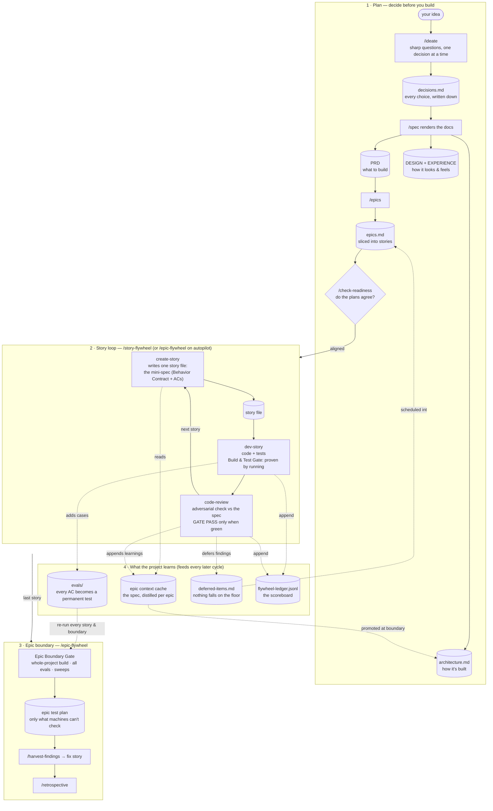

[← Back to README](../README.md)

# Spec-Driven Development, explained simply

## The five-year-old version

Imagine you hire a very fast builder who has one quirk: **every morning they wake up
with no memory of yesterday.** They're brilliant, they work at superhuman speed — but
if you just say "build me a house," each day they'll guess at what you meant, and every
day they'll guess a little differently.

The fix is old technology: **write it down.** Draw the blueprint before laying bricks.
Each morning the builder reads the blueprint instead of guessing. And when an inspector
comes by, they don't ask "does this look nice?" — they hold the work up against the
blueprint and check: *is this what the plan said?*

That's Spec-Driven Development. The AI is the fast builder with no memory between
sessions. The **spec** — your written-down decisions about what to build, how it should
behave, and how it's structured — is the blueprint. Code isn't "done" when it exists;
it's done when it **matches the spec and a machine has proven it** (a real build, real
tests, run right now — never "it looks right to me").

Three rules fall out of this:

1. **Decide before you build.** Every choice gets written down *before* code exists,
   so there's something objective to check against.
2. **The spec is the memory.** New session, new subagent, next month's you — everyone
   reads the same docs instead of re-guessing.
3. **Verify against the spec, by running.** "Done" is a gate that passes, not a vibe.

## How leanwheel-skills does it

Leanwheel turns that idea into a chain of small written artifacts, where **each
artifact is the input to the next step** — and into loops that keep checking the code
against them. You never hold the whole project in your head (or in the AI's context);
you hold one small spec at a time.

### Reading the diagram

**1 · Plan.** [`/ideate`](../.claude/skills/ideate/SKILL.md) pulls decisions out of you
one at a time and records them in `decisions.md` — the unit of planning progress is the
*decision*, not the document. [`/spec`](../.claude/skills/spec/SKILL.md) then renders
those decisions into the blueprint docs (PRD, UX, architecture), and
[`/epics`](../.claude/skills/epics/SKILL.md) slices the PRD into bite-sized stories.
[`/check-readiness`](../.claude/skills/check-readiness/SKILL.md) is the "do the
blueprints contradict each other?" gate before any code is written.

**2 · Story loop.** Each story file is a *mini-spec*: a Behavior Contract ("given X,
the app does Y"), edge-case acceptance criteria, and a Design Contract. The dev phase
implements it and must prove it works **by running** the real build and tests — a gate
that has never been seen red is itself suspect, so new tests are deliberately broken
once to prove they can fail. The review phase then plays inspector: it reads the diff
adversarially *against the story's contract*, not against taste. Each phase runs in
its own throwaway subagent, so only short reports accumulate — the artifacts on disk,
not a long chat, carry the state.

**3 · Epic boundary.** When the last story lands, the whole project is re-verified at
once: full build, the entire accumulated eval set, and sweeps for anything left
unverified or unscheduled. What's left over becomes a *human* test plan containing only
the things machines can't check — every step already covered by an automated test is
subtracted out.

**4 · Memory.** This is what makes the loops compound instead of reset. The epic
context cache means story 7 doesn't re-read the whole PRD — it reads a distilled page
that includes what stories 1–6 learned. Every acceptance criterion becomes a permanent
eval, so old promises are re-checked on every future story, exactly like a red build.
Deferred findings are auto-scheduled into future stories instead of dying in a chat
log. And the ledger records one machine-readable line per phase (via
`scripts/ledger.sh`) so you can *see* drift — rising build iterations, falling review
gates — instead of sensing it.

## The one-sentence summary

Write the decision down before building, make every claim a runnable check, and let
each artifact feed the next loop — so a fast builder with no memory still ships a
coherent house.
