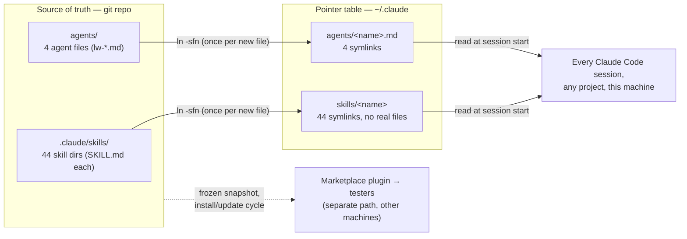

[← Back to README](../README.md)

# The Symlink Layer — how skills load live on the maintainer's machine

Why editing a skill in this repo changes every Claude Code session on the machine by
the next restart — no install, no update, no copy step. The whole mechanism is 48
symbolic links.

Claude Code loads personal skills from `~/.claude/skills/<name>/` and personal agents
from `~/.claude/agents/<name>.md`, in every project. Instead of copying files there,
each of those entries is a **symlink pointing back into this git repo**. The files are
only ever stored once — in the repo — and the personal directories are just a table of
pointers.



Two distribution paths from one repo. The maintainer's machine uses the live symlink
path: edits to a file in the repo are visible through the link immediately, and the
next session start picks them up. Testers use the plugin path: a frozen snapshot that
only changes on install/update.

## What's actually on disk

Every entry in the personal skills directory is a link, not a directory — note the `l`
in the mode column and the `->` targets:

```
$ ls -l ~/.claude/skills
lrwxr-xr-x  code-review    -> …/leanwheel-skills/.claude/skills/code-review/
lrwxr-xr-x  create-story   -> …/leanwheel-skills/.claude/skills/create-story/
lrwxr-xr-x  dev-story      -> …/leanwheel-skills/.claude/skills/dev-story/
lrwxr-xr-x  epic-flywheel  -> …/leanwheel-skills/.claude/skills/epic-flywheel/
lrwxr-xr-x  story-flywheel -> …/leanwheel-skills/.claude/skills/story-flywheel/
… 44 leanwheel symlinks total …
drwxr-xr-x  reset-git-staging-branch        ← real dir, NOT from this repo

$ ls -l ~/.claude/agents
lrwxr-xr-x  lw-docs-sync.md        -> …/leanwheel-skills/agents/lw-docs-sync.md
lrwxr-xr-x  lw-story-creator.md    -> …/leanwheel-skills/agents/lw-story-creator.md
lrwxr-xr-x  lw-story-developer.md  -> …/leanwheel-skills/agents/lw-story-developer.md
lrwxr-xr-x  lw-story-reviewer.md   -> …/leanwheel-skills/agents/lw-story-reviewer.md
```

## The two moves

| When | What you do | Why |
|---|---|---|
| **Editing an existing skill or agent** | Nothing. Edit the file in the repo, restart the session. | The symlink is live — reads resolve through it to the repo file, so the personal dir never goes stale. |
| **Adding a *new* skill or agent** | Re-run the sync one-liner below, then restart. | A brand-new file has no symlink yet, so it silently fails to load until one is created. |

The sync command re-links everything idempotently (`-sfn` replaces an existing link in
place, so running it repeatedly is safe):

```bash
for d in ~/Git-Repos/leanwheel-skills/.claude/skills/*/; do ln -sfn "$d" ~/.claude/skills/"$(basename "$d")"; done
```

```bash
for a in ~/Git-Repos/leanwheel-skills/agents/*.md; do ln -sfn "$a" ~/.claude/agents/"$(basename "$a")"; done
```

## Why symlinks instead of installing the plugin?

This repo also ships as a marketplace plugin (`leanwheel`), but an installed plugin is
a **frozen snapshot** — it only changes on an explicit update. That's the right
behavior for testers, and the wrong behavior for the person editing the skills forty
times a day. The symlink layer gives the maintainer a zero-step publish loop:
*save file → restart session → live everywhere*.

One additional reason it's load-bearing: the macOS app does **not** auto-load skills
from a project's `additionalDirectories`, so the personal-dir links are what make
these skills available in every project at all.

## Gotchas

- **New files fail silently.** Forgetting the sync after adding a skill produces no
  error — the skill just never appears. (This is exactly how `swift-audit` went
  missing once.) The root [CLAUDE.md](../CLAUDE.md) carries a reminder for this reason.
- **One entry is not ours.** `~/.claude/skills/reset-git-staging-branch` is a real
  directory from elsewhere, not a repo symlink. Don't delete or re-link it when
  syncing.
- **Links follow the checkout, not a branch.** The links point at the working tree of
  the main checkout. Whatever branch that checkout has on disk is what loads — git
  worktrees under `.claude/worktrees/` are separate copies and are *not* what the
  symlinks serve.

**To verify on any machine:** `ls -l ~/.claude/skills` — pointer table or real files,
the mode column tells you in one glance.
