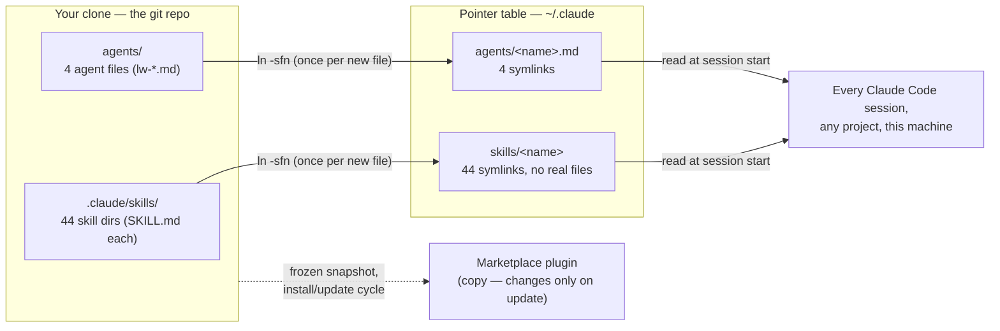

[← Back to README](../README.md)

# Symlinks or the Plugin?

There are two ways to get these skills into Claude Code: **install the marketplace
plugin**, or **clone the repo and symlink it into your personal `~/.claude`
directories**. They deliver the same files — what differs is *when changes reach your
sessions*. This guide teaches you the difference and when to pick each.

## The core difference in one sentence

An installed plugin is a **frozen snapshot** — a copy taken at install time that only
changes when you explicitly update. A symlink is a **pointer, not a copy** — Claude
Code reads *through* it into your clone's working tree, so whatever is on disk in the
repo right now is what loads at the next session start.



Both paths start from the same repo. The plugin path (dashed) copies; the symlink path
(solid) points. That one distinction drives everything below.

## Which one is for you?

**Use the plugin if you consume the skills.** You run `/story-flywheel` and
`/code-review`; you don't edit them. The snapshot is a feature: your workflow doesn't
change under you mid-project, and you pull improvements deliberately, when *you*
choose to update. This is the right default for almost everyone.

**Use symlinks if you change the skills.** The moment you're editing a `SKILL.md` and
want to feel the difference, the plugin's install→update cycle becomes friction you
pay dozens of times a day. Symlinks collapse the publish loop to nothing:

> save file → restart session → live in every project

No commit, no version bump, no update command. You can edit a skill *while a project
session has surfaced the problem*, restart, and re-run. This is how this repo itself
is developed: the maintainer never installs the plugin locally — testers get the
snapshot, the editing machine gets the live pointers.

There's also a practical platform reason the links target the *personal* directories:
the macOS app does **not** auto-load skills from a project's `additionalDirectories`,
so `~/.claude/skills` symlinks are what make a cloned skill set load in every project
at all.

## Setting it up

Clone the repo, then create one symlink per skill directory and one per agent file.
`-sfn` replaces an existing link in place, so re-running is always safe (idempotent):

```bash
for d in ~/Git-Repos/leanwheel-skills/.claude/skills/*/; do ln -sfn "$d" ~/.claude/skills/"$(basename "$d")"; done
```

```bash
for a in ~/Git-Repos/leanwheel-skills/agents/*.md; do ln -sfn "$a" ~/.claude/agents/"$(basename "$a")"; done
```

Afterwards, the personal directory holds no real files — just pointers. The `l` in
the mode column is how you tell:

```
$ ls -l ~/.claude/skills
lrwxr-xr-x  code-review    -> …/leanwheel-skills/.claude/skills/code-review/
lrwxr-xr-x  dev-story      -> …/leanwheel-skills/.claude/skills/dev-story/
lrwxr-xr-x  epic-flywheel  -> …/leanwheel-skills/.claude/skills/epic-flywheel/
… 44 leanwheel symlinks total …
drwxr-xr-x  some-other-skill        ← a real dir = not from this repo
```

## The trade-offs you're accepting

Symlinks trade the plugin's safety rails for speed. Know what you gave up:

- **New files fail silently.** Editing through an existing link needs nothing — but a
  brand-new skill or agent has no link yet, and there's no error: it just never
  appears. After *adding* a file, re-run the one-liners above and restart. (This is
  exactly how `swift-audit` once went missing on the maintainer's machine; the root
  [CLAUDE.md](../CLAUDE.md) carries a standing reminder.)
- **Whatever is on disk loads — including your half-finished edit.** There's no
  "published version." A broken mid-refactor `SKILL.md` is live at the next session
  start, on every project. The plugin never has this problem.
- **Links follow the checkout, not a branch.** The pointers resolve to the working
  tree of your clone. Switch branches, and every session on the machine switches with
  you — and git worktrees (e.g. under `.claude/worktrees/`) are separate copies the
  links do *not* serve.
- **Mind your existing skills.** The loop only touches names that exist in the repo,
  but don't blindly delete-and-relink `~/.claude/skills` — anything there that's a
  real directory came from somewhere else and should be left alone.

**To check which mode any machine is in:** `ls -l ~/.claude/skills` — pointers mean
live-edit mode, real directories mean installed copies. The mode column tells you in
one glance.
