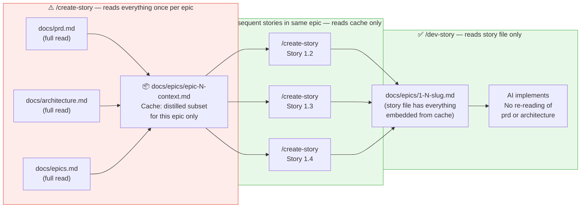

[← Back to README](../README.md)

## How the Token Budget Works
*Why this is cheaper than full BMAD — and how the cache makes it even cheaper.*

> **The key insight:** You pay the full reading cost once (when creating the first story in an epic).
> Every story after that uses the cache. The `/dev-story` agent only ever reads the story file —
> never the PRD or architecture doc — because `/create-story` embedded everything it needs.

---

## Token Spend Reduction vs Original BMAD

Estimates based on a typical project: 3 epics × 4 stories each = 12 stories.

### Per-invocation savings

| Source of waste | Original BMAD | Leanwheel | Saved |
|----------------|--------------|-----------|-------|
| Activation ceremony (per skill call) | ~700 tokens | 0 | 700/call |
| Architecture skill (8 JIT step files) | ~4,500 tokens | ~1,200 tokens | 3,300 |
| UX skill (SKILL.md + 3 refs + customize.toml + Sally persona + 5 example assets + creative tools) | ~12,600 tokens | ~4,100 tokens (skill.md + checklist + 2 templates) | ~8,500/run |
| `sprint-status.yaml` read (per dev/review call) | ~300 tokens | 0 | 300/call |
| Agent persona overhead (per skill call) | ~400 tokens | 0 | 400/call |
| `create-story` reading full PRD + arch (per story) | ~4,500 tokens | ~500 tokens (cache hit) | 4,000/story |
| Separate code-review session startup (per story) | ~1,800 tokens | 0 (inline) | 1,800/story |

### Across a 12-story project

| Phase | Original BMAD | Leanwheel | Reduction |
|-------|--------------|-----------|-----------|
| Planning (PRD + arch + epics) | ~18,000 | ~8,000 | ~55% |
| `/ux` (1 Create run per project) | ~12,600 | ~4,100 | ~67% |
| `create-story` × 12 | ~58,000 | ~14,000 | ~76% |
| `dev-story` + `code-review` × 12 | ~62,000 | ~42,000 | ~32% |
| Retrospective × 3 epics | ~12,000 | ~4,500 | ~63% |
| **Total** | **~162,600** | **~72,600** | **~55%** |

> These are input token estimates. Output tokens (the AI's actual writing) are roughly the same in both systems — the savings are entirely on the reading/loading side.

### What session hygiene adds on top

Original BMAD typically runs multi-phase sessions, so the PRD and architecture sit in context during `create-story` and `dev-story` even though they're not needed. Leanwheel's one-session-per-phase rule eliminates this accumulated context tax — conservatively another **10–20%** reduction on top of the numbers above.

### What subagent isolation adds on top

When using `/story-flywheel`, each phase runs in a throwaway context. The story creator reads PRD + architecture + epics, distills the story, and exits — those docs never enter the main thread. The developer reads only the story file. The reviewer reads only the diff. This is an additional **10–15%** reduction on the main thread versus running the same phases manually in a single long session.

### Bottom line

Leanwheel uses roughly **half the tokens** of original BMAD for the same 12-story project — primarily by eliminating the activation ceremony, caching epic context, inlining code review, and enforcing session hygiene. The Claude Pro $15/month plan includes ~1.5M input tokens/month on Sonnet; a 12-story project in Leanwheel costs roughly **~70K tokens**, leaving substantial budget for iteration and experimentation.
