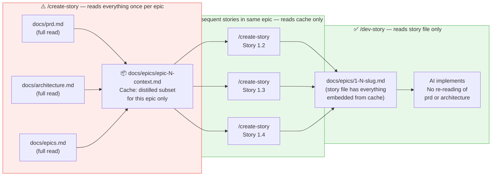

[← Back to README](../README.md)

## How the Token Budget Works
*Why this is cheaper than full BMAD — and how the cache makes it even cheaper.*

> Estimates last recalculated **2026-07-08** against upstream **BMAD Method v6.10.0** (commit `49069b8`).
> Method: measured bytes of every file a full skill run loads (SKILL.md + step files + checklists + TOML + templates), converted at ~4 chars/token. These are input-token estimates; output tokens (the AI's actual writing) are roughly the same in both systems.

> **The key insight:** You pay the full reading cost once (when creating the first story in an epic).
> Every story after that uses the cache. The `/dev-story` agent only ever reads the story file —
> never the PRD or architecture doc — because `/create-story` embedded everything it needs.
>
> Upstream has since adopted this same pattern inside `bmad-dev-auto` (it compiles an
> `epic-N-context.md` too) — but only in that autonomous loop. Its standalone
> `bmad-create-story` still mandates exhaustive re-analysis of PRD + architecture +
> epics + UX on every story.

---

## What changed since the last estimate

Both systems grew — but not equally. The upstream v6 rewrite roughly **tripled** its per-run skill payloads (the retrospective is now a single 67KB SKILL.md; the PRD workflow is 61KB across 8 JIT step files), and the activation ceremony got *bigger* (~1,000 tokens/call: three-tier TOML resolution, config.yaml load, persistent facts, greeting, prepend/append hooks). Leanwheel's skills also grew — the Build & Test Gate, Behavior/Design Contracts, evals, and flywheel orchestration are real additions — but the lean single-pass structure kept the growth to roughly a third of upstream's. The net effect: the percentage savings **held or improved** even though both absolute numbers went up.

## Per-invocation skill-load comparison

Tokens loaded per full run of each skill (skill assets + ceremony; excludes project-doc reads, which are compared separately below).

| Skill | BMAD v6.10 | Leanwheel | Saved |
|-------|-----------|-----------|-------|
| Activation ceremony (every skill call) | ~1,000 | 0 | 1,000/call |
| `create-story` (skill + checklist + TOML + templates) | ~12,000 | ~3,900 | ~8,100 |
| `dev-story` | ~9,200 | ~4,000 (inline review included) | ~5,200 |
| `code-review` (upstream: separate session, 4 step files) | ~9,000 | ~2,600 | ~6,400 |
| `retrospective` (upstream: one 67KB SKILL.md) | ~17,800 | ~2,100 | ~15,700 |
| `prd` (upstream: 8 JIT step files) | ~15,200 | ~1,700 | ~13,500 |
| `architecture` | ~12,700 | ~1,200 | ~11,500 |
| `epics` | ~10,300 | ~1,300 | ~9,000 |
| `check-readiness` | ~8,400 | ~1,900 | ~6,500 |
| `ux` (upstream: 17 files; ~35KB loads on a typical Create run) | ~9,000–11,000 | ~5,800 | ~4,000+ |
| Agent persona overhead (upstream `bmad-agent-*`, when used) | ~2,000 | 0 | 2,000/session |
| `sprint-status.yaml` bookkeeping (per dev/review call) | ~300 | 0 (GitHub labels via `gh-track.sh`, zero-token) | 300/call |
| `create-story` doc reads (per story after the first in an epic) | ~5,000 (full PRD + arch + epics + UX) | ~500 (epic-context cache) | ~4,500/story |

## Across a 12-story project

3 epics × 4 stories, input/loading side, including project-doc reads. The Leanwheel column assumes the flywheel (subagent) path and includes its orchestration overhead.

| Phase | BMAD v6.10 | Leanwheel | Reduction |
|-------|-----------|-----------|-----------|
| Planning (PRD + architecture + epics + readiness gate) | ~55,000 | ~14,000 | ~75% |
| `/ux` (1 Create run) | ~10,000 | ~8,000 | ~20% |
| `create-story` × 12 | ~200,000 | ~65,000 | ~67% |
| `dev-story` + review × 12 | ~285,000 | ~110,000 (review inline) | ~61% |
| Retrospective × 3 epics | ~54,000 | ~11,000 | ~80% |
| Flywheel orchestration (3 epics) | — | ~15,000 | — |
| **Total** | **~600,000** | **~220,000** | **~63%** |

> The Leanwheel total also *buys more* than the upstream total: it includes the Behavior
> Contract / edge-case AC pass, Design Contract extraction, invariant verification, and the
> inline adversarial review — verification layers upstream's equivalent phases don't run.

### Where Leanwheel spends nothing at all

Several layers added since the original estimate were designed to be **zero-token or off-model**, so they don't appear in the table:

- **Deterministic hooks** (secret guard, design-token guard, activity log) — pure bash, never call a model.
- **Evals RUN** — the cumulative regression net is `type: command` shell execution; a 50-case eval set costs 0 tokens to run.
- **Build & Test Gate** — toolchain commands, not model reads; it *saves* tokens by catching regressions that would otherwise trigger re-fix loops.
- **GitHub tracking** — label transitions moved into `scripts/gh-track.sh` (one shell call replaces a view→parse→edit→verify model round-trip per transition).
- **Ledger/observability** — shell-append JSONL, never read into context.
- **docs-sync** — routed to a **Haiku** subagent, so mechanical doc maintenance never lands on the dev model (which is Opus on Swift projects).

### What session hygiene adds on top

Original BMAD typically runs multi-phase sessions, so the PRD and architecture sit in context during `create-story` and `dev-story` even though they're not needed. Leanwheel's one-session-per-phase rule eliminates this accumulated context tax — conservatively another **10–20%** reduction on top of the numbers above.

### What subagent isolation adds on top

When using `/story-flywheel` or `/epic-flywheel`, each phase runs in a throwaway subagent context. The story creator reads PRD + architecture + epics, distills the story, and exits — those docs never enter the main thread. The developer reads only the story file. The reviewer reads only the diff. Of the ~220K project total, the **orchestrating thread holds only ~15–20K** (skill + short structured reports); everything else lives in disposable windows. On top of isolation, the flywheels do **model routing**: create/review run on Sonnet, docs maintenance on Haiku, and Opus is reserved for Swift dev passes where a cheaper model's failed build loops would cost more than one accurate pass.

### Bottom line

Leanwheel uses roughly **a third of the tokens** of BMAD v6 for the same 12-story project (~220K vs ~600K on the loading side) — while running more verification (build gates, evals, invariant checks, inline review) than upstream does. The savings come from the same four levers as before, all of which survived both systems' growth: no activation ceremony, epic-context caching, inline review, and session hygiene — now compounded by subagent isolation, model routing, and the zero-token guardrail/eval/tracking layers.
