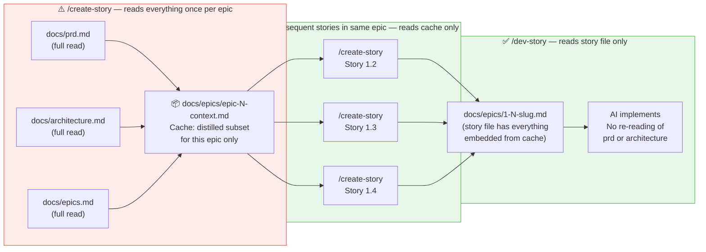

[← Back to README](../README.md)

## How the Token Budget Works
*Why this is cheaper than full BMAD — and how the cache makes it even cheaper.*

> Estimates last recalculated **2026-07-08** against upstream **BMAD Method v6.10.0** (commit `49069b8`).
> Method: measured bytes of every file a full skill run loads (SKILL.md + step files + checklists + TOML + templates), converted at ~4 chars/token. These are input-token estimates; output tokens (the AI's actual writing) are roughly the same in both systems.


```mermaid
flowchart LR
    subgraph EXPENSIVE ["⚠️ /create-story — reads everything once per epic"]
        P["docs/prd.md\n(full read)"]
        AR["docs/architecture.md\n(full read)"]
        EP["docs/epics.md\n(full read)"]
        P & AR & EP --> CACHE["📦 docs/epics/epic-N-context.md\nCache: distilled subset\nfor this epic only"]
    end

    subgraph CHEAP ["✅ Subsequent stories in same epic — reads cache only"]
        CACHE --> S2["/create-story\nStory 1.2"]
        CACHE --> S3["/create-story\nStory 1.3"]
        CACHE --> S4["/create-story\nStory 1.4"]
    end

    subgraph DEVSTORY ["✅ /dev-story — reads story file only"]
        S2 & S3 & S4 --> SF["docs/epics/1-N-slug.md\n(story file has everything\nembedded from cache)"]
        SF --> DEV["AI implements\nNo re-reading of\nprd or architecture"]
    end

    style EXPENSIVE fill:#fdecea,stroke:#E74C3C
    style CHEAP fill:#e8f8e8,stroke:#4CAF50
    style DEVSTORY fill:#e8f8e8,stroke:#4CAF50
```

> **The key insight:** You pay the full reading cost once (when creating the first story in an epic).
> Every story after that uses the cache. The `/dev-story` agent only ever reads the story file —
> never the PRD or architecture doc — because `/create-story` embedded everything it needs.
>
> Upstream has since adopted this same pattern inside `bmad-dev-auto` (it compiles an
> `epic-N-context.md` too) — but only in that autonomous loop. Its standalone
> `bmad-create-story` still mandates exhaustive re-analysis of PRD + architecture +
> epics + UX on every story.

---

## What changed since the last estimate

Both systems grew — but not equally. The upstream v6 rewrite roughly **tripled** its per-run skill payloads (the retrospective is now a single 67KB SKILL.md; the PRD workflow is 61KB across 8 JIT step files), and the activation ceremony got *bigger* (~1,000 tokens/call: three-tier TOML resolution, config.yaml load, persistent facts, greeting, prepend/append hooks). Leanwheel's skills also grew — the Build & Test Gate, Behavior/Design Contracts, evals, and flywheel orchestration are real additions — but the lean single-pass structure kept the growth to roughly a third of upstream's. The net effect: the percentage savings **held or improved** even though both absolute numbers went up.

## Per-invocation skill-load comparison

Tokens loaded per full run of each skill (skill assets + ceremony; excludes project-doc reads, which are compared separately below).

> The `prd`, `architecture`, and `ux` rows (here and in the project table below) were measured before those skills consolidated into `/ideate` + `/spec` (they remain as thin aliases); the numbers stand as the last measured comparison until the next recalculation measures `/spec` directly.

| Skill | BMAD v6.10 | Leanwheel | Saved |
|-------|-----------|-----------|-------|
| Activation ceremony (every skill call) | ~1,000 | 0 | 1,000/call |
| `create-story` (skill + checklist + TOML + templates) | ~12,000 | ~3,900 | ~8,100 |
| `dev-story` | ~9,200 | ~4,000 (measured with the review inline — see note below) | ~5,200 |
| `code-review` (upstream: separate session, 4 step files) | ~9,000 | ~2,600 | ~6,400 |
| `retrospective` (upstream: one 67KB SKILL.md) | ~17,800 | ~2,100 | ~15,700 |
| `prd` (upstream: 8 JIT step files) | ~15,200 | ~1,700 | ~13,500 |
| `architecture` | ~12,700 | ~1,200 | ~11,500 |
| `epics` | ~10,300 | ~1,300 | ~9,000 |
| `check-readiness` | ~8,400 | ~1,900 | ~6,500 |
| `ux` (upstream: 17 files; ~35KB loads on a typical Create run) | ~9,000–11,000 | ~5,800 | ~4,000+ |
| Agent persona overhead (upstream `bmad-agent-*`, when used) | ~2,000 | 0 | 2,000/session |
| `sprint-status.yaml` bookkeeping (per dev/review call) | ~300 | 0 (GitHub labels via `gh-track.sh`, zero-token) | 300/call |
| `create-story` doc reads (per story after the first in an epic) | ~5,000 (full PRD + arch + epics + UX) | ~500 (epic-context cache) | ~4,500/story |

## Across a 12-story project

3 epics × 4 stories, input/loading side, including project-doc reads. The Leanwheel column assumes the flywheel (subagent) path and includes its orchestration overhead.

| Phase | BMAD v6.10 | Leanwheel | Reduction |
|-------|-----------|-----------|-----------|
| Planning (PRD + architecture + epics + readiness gate) | ~55,000 | ~14,000 | ~75% |
| `/ux` (1 Create run) | ~10,000 | ~8,000 | ~20% |
| `create-story` × 12 | ~200,000 | ~65,000 | ~67% |
| `dev-story` + review × 12 | ~285,000 | ~110,000 (review inline when measured) | ~61% |
| Retrospective × 3 epics | ~54,000 | ~11,000 | ~80% |
| Flywheel orchestration (3 epics) | — | ~15,000 | — |
| **Total** | **~600,000** | **~220,000** | **~63%** |

> The Leanwheel total also *buys more* than the upstream total: it includes the Behavior
> Contract / edge-case AC pass, Design Contract extraction, invariant verification, and the
> inline adversarial review — verification layers upstream's equivalent phases don't run.

> **Review is no longer inline (DD-75).** The rows above were measured when dev-story reviewed
> its own diff. Now a fresh `lw-story-reviewer` does it on every story, and that re-reads what
> independence requires — the story up to its Dev Agent Record, `CLAUDE.md`, the routed guidance,
> and the diff: roughly 10–24K input tokens per story in a disposable window. Against that,
> dev-story no longer carries the review instructions (~1.4K per story), and the review turns no
> longer re-send the whole implementation history, which the load-based numbers here never
> counted. The net is unmeasured; `code-review` ledger lines are tagged `standalone`, so a real
> project's ledger is where to settle it. On Swift projects the review also moved from Opus to
> Sonnet.

### Where Leanwheel spends nothing at all

Several layers added since the original estimate were designed to be **zero-token or off-model**, so they don't appear in the table:

- **Deterministic hooks** (secret guard, design-token guard, activity log) — pure bash, never call a model.
- **Evals RUN** — `scripts/evals.sh` owns collection, batching, assertion and reporting, so a 50-case eval set costs 0 tokens to run *and* 0 to collect. This was previously only half true: execution was free, but a model had to read every case block in `docs/evals/*.md` to gather and group them, a cost that grew with every story. The script also doubles as the CI seam.
- **Build & Test Gate** — toolchain commands, not model reads; it *saves* tokens by catching regressions that would otherwise trigger re-fix loops.
- **GitHub tracking** — label transitions moved into `scripts/gh-track.sh` (one shell call replaces a view→parse→edit→verify model round-trip per transition).
- **Ledger/observability** — shell-append JSONL, never read into context.
- **docs-sync** — routed to a **Haiku** subagent, so mechanical doc maintenance never lands on the dev model (which is Opus on Swift projects).
- **Effort routing** — the second cost axis, invisible in every table above because it governs *output* tokens (thinking and tool calls), not the input loads measured here. Each phase-runner pins `effort:` in its agent def (creator `medium`, developer and reviewer `high`, docs-sync `low`) instead of inheriting the session's. A subagent spawn is its own conversation, so pinning costs no prompt cache — and it stops a `max`-effort session leaking past the model cost ceiling into every phase. Per Anthropic's guidance these levels should be swept against `evals/`, not assumed.

### What session hygiene adds on top

Per-session habits that compound with the design choices below (from Anthropic's
[session-value guidance](https://claude.com/blog/maximizing-the-value-of-your-claude-code-sessions)):

- Run `/context` at the start of a session and prune what isn't needed — disable unused MCP
  servers with `/mcp`; they cost tokens on every turn whether or not they're called.
- Set `/model` and `/effort` once, before the first turn. Changing either mid-session busts the
  prompt cache — this is why the flywheels route models per *subagent* and never ask you to
  switch. Start a fresh session if you want a different model for the next epic.
- `/clear` between unrelated tasks; `/compact` before a break longer than an hour (the cache
  expires, and compacting while cached is much cheaper). `/rewind` to drop only the last turns.
- Prefer quiet toolchain flags and `tee` logs to disk — dev-story's Build & Test Gate and the
  scaffolded `## Quiet commands` CLAUDE.md section do this for you.
- One long session costs more than the same work across several short ones: turn 40 re-sends
  turns 1–39. The flywheels keep the orchestrator thread to short reports for exactly this reason.

Original BMAD typically runs multi-phase sessions, so the PRD and architecture sit in context during `create-story` and `dev-story` even though they're not needed. Leanwheel's one-session-per-phase rule eliminates this accumulated context tax — conservatively another **10–20%** reduction on top of the numbers above.

### What subagent isolation adds on top

When using `/story-flywheel` or `/epic-flywheel`, each phase runs in a throwaway subagent context. The story creator reads PRD + architecture + epics, distills the story, and exits — those docs never enter the main thread. The developer reads only the story file. The reviewer reads only the diff. Of the ~220K project total, the **orchestrating thread holds only ~15–20K** (skill + short structured reports); everything else lives in disposable windows. On top of isolation, the flywheels do **model routing**: create/review run on Sonnet, docs maintenance on Haiku, and Opus is reserved for Swift dev passes where a cheaper model's failed build loops would cost more than one accurate pass.

### What epics.md condensing adds on top

`docs/epics.md` is read *in full* by `check-readiness`, the first `create-story` of each epic, every `retrospective`, `correct-course`, `doc-review`, and `epics` update run — roughly **15–25 full reads** over a project's life. Left alone it grows monotonically: every shipped story's user-story statement and Given/When/Then ACs sit in it forever, duplicating the story file that already holds the same ACs plus the implementation record. `/epic-archive` **CONDENSE** (called by `/retrospective` at epic close) collapses a closed epic's `done` story bodies to one summary row each.

Order of magnitude, with the assumptions stated:

| Assumption | Estimate |
|------------|----------|
| One full story entry in `epics.md` (user story + 3–5 Given/When/Then ACs) | ~170 tokens |
| A 5-story epic's collapsible detail | ~900 tokens |
| The same epic as a summary table (one row per story, with the story-file link) | ~120–150 tokens |
| **Net per closed epic, per full read of `epics.md`** | **~750 tokens** |

The benefit is therefore a function of project *length*, not of any single run. On the 12-story project above (3 epics, ~2 of them closed before the end) it is a few thousand tokens — **negligible** against the ~220K total. On a long or multi-phase project — say 8 epics with ~10 full reads still ahead — the same arithmetic is ~5K per read, i.e. **tens of thousands of tokens**, and it compounds because uncondensed detail is re-paid on every subsequent read. **CUT-RELEASE** takes a shipped release's file out of the read path entirely, replacing it with one row in a `## Shipped Releases` table.

The ops themselves are near-free: a structured edit over one file, once per epic close — no doc synthesis, no subagent, idempotent.

### The file this analysis kept missing: `CLAUDE.md`

Every number above measures a file read *when a skill runs*. The project's `CLAUDE.md` is
read **every turn**, by every skill, forever — the highest-leverage file in the budget and
invisible in the tables: a 600-line CLAUDE.md is 6K on every turn of every session.
Hence the **≤300-line budget** and the T1/T2/T3 tier system defined in
`.claude/skills/setup/claude-template.md` (over budget → demote or move, never append),
enforced advisorily by `guard-context-budget.sh` at write time and audited by
`/retrospective`'s tier audit at every epic close.

### Per-file ceilings for leanwheel's own assets

The failure mode this document criticizes upstream for — a single 67KB `retrospective`
SKILL.md — is reachable from here by pure accretion. Each addition is defensible; the sum is not.

**The ceiling is measured in bytes, not lines.** It used to be lines, and that metric was
measuring the wrong thing: line count and token cost turn out to be close to uncorrelated
across this repo's skills, because a step-list skill wraps at 60 characters and a
table-and-prose skill runs to 200.

| Skill | Lines | ~Tokens | Under the old 300-line ceiling? |
|---|---|---|---|
| `epic-flywheel` | 263 | **6,450** | yes — and it is the most expensive file in the repo |
| `dev-story` | 226 | 5,922 | yes |
| `appstore-connect` | 184 | 5,552 | yes, comfortably |
| `swift-audit` | 355 | 3,816 | no — flagged as debt at 60% of epic-flywheel's cost |

Ranking by lines put the cheapest of those four in the penalty box and gave the most
expensive one a clean bill of health. Bytes are what get tokenized, so bytes are the budget.

| Asset | Ceiling | Over it → |
|---|---|---|
| `.claude/skills/*/SKILL.md` | **20 KB** (~5,000 tokens) | extract to a JIT-loaded reference file in the skill's directory that the skill reads *only when the branch needs it* — never pad the main file |
| `agents/*.md` | **4 KB** (~1,000 tokens) | same: the agent's job list and report contract stay; detail moves to the skill it invokes |
| Stubs (`stubs/**`) | no fixed ceiling — they are project-installed, not per-invocation | keep them one topic per file |

**Enforced as a ratchet**, zero tokens:

```bash
bash scripts/test/budget.sh            # exit 1 if a file over budget grew, or a new one went over
bash scripts/test/budget.sh --update   # lower ceilings to current sizes; retire paid-off debt
```

Files that were already over when the budget arrived are grandfathered in
`scripts/test/budget-baseline.txt`, and **may shrink but never grow**. A ceiling broken on
day one and never enforced is one people learn to ignore; the ratchet stops accretion
immediately and lets the debt come down as it is worked. `--update` never raises a ceiling
and never adds a file — new debt is a deliberate, reviewed edit to the baseline.

Current debt (three files): `epic-flywheel`, `story-flywheel`, and
`agents/lw-story-developer.md` — `budget.sh` prints the live figures. Both App Store skills
were paid off by splitting them along the lines below (DD-74), and `dev-story` by moving its
review out to an independent reviewer (DD-75). Two distinct fixes
apply, and they are not interchangeable:

- **Mutually-exclusive branches** (`appstore-*`, `swift-audit`, `setup`) — route the
  conditional blocks out to reference files the skill reads only on the branch that needs
  them. Nothing is lost; it just stops loading unconditionally.
- **Prose that the model no longer needs** (`dev-story`, and the review passes it carries) —
  cut it. Current Claude 5 guidance is explicit that carried-over verification instructions
  cause *over*-verification, so a chunk of this is not just costly but counterproductive.
  Deterministic gates (`sabotage.sh`, `evals.sh`, the Build & Test Gate) stay; the conduct
  prose around them is what goes.

### Bottom line

Leanwheel uses roughly **a third of the tokens** of BMAD v6 for the same 12-story project (~220K vs ~600K on the loading side) — while running more verification (build gates, evals, invariant checks, an independent review) than upstream does. The savings come from three levers that survived both systems' growth — no activation ceremony, epic-context caching, and session hygiene; a fourth, inline review, was given up for independence (DD-75) — now compounded by subagent isolation, model routing, and the zero-token guardrail/eval/tracking layers.
