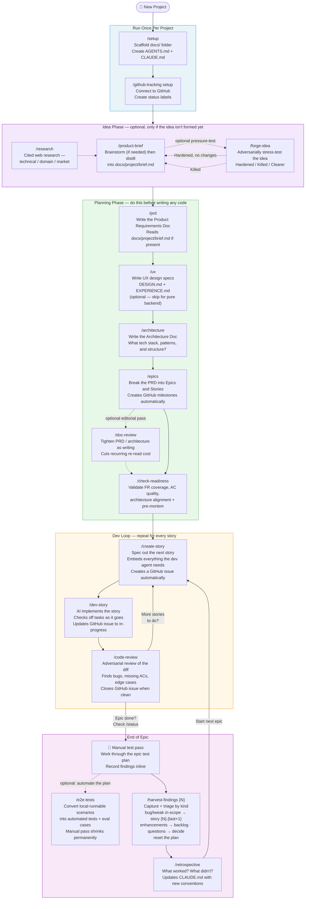
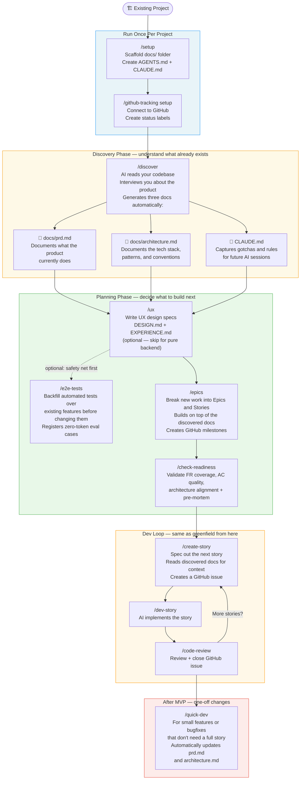

[← Back to README](../README.md)

## Greenfield Process
*Use this when starting a brand-new project from scratch.*

---

## Brownfield Process
*Use this when you already have an existing codebase and want to start using this workflow.*

