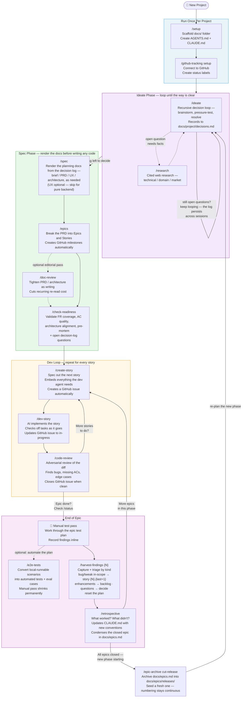
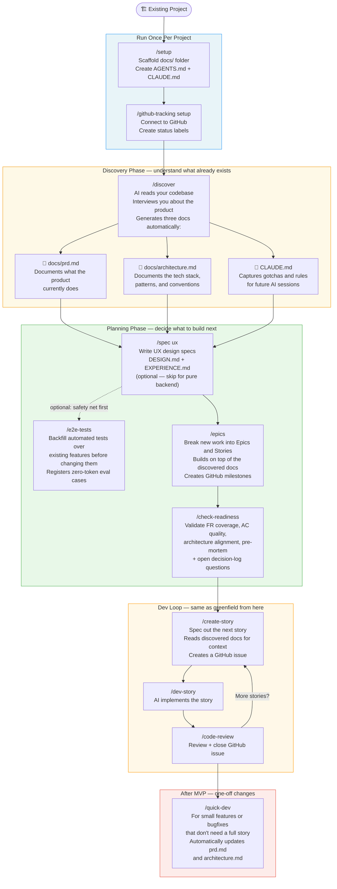

[← Back to README](../README.md)

> **You don't need to memorize these maps.** Run `/next` in any session — it detects project state (zero-token file checks) and routes you to the single next command on these charts.

## Greenfield Process
*Use this when starting a brand-new project from scratch.*

```mermaid
flowchart TD
    A([🚀 New Project]) --> B

    subgraph ONCE ["Run Once Per Project"]
        B["/setup\nScaffold docs/ folder\nCreate AGENTS.md + CLAUDE.md"]
        B --> C["/github-tracking setup\nConnect to GitHub\nCreate status labels"]
    end

    C --> IDEA

    subgraph IDEA ["Ideate Phase — loop until the way is clear"]
        PB["/ideate\nRecursive decision loop —\nbrainstorm, pressure-test, resolve\nRecords to docs/project/decisions.md"]
        PB -.->|"open question\nneeds facts"| RS["/research\nCited web research —\ntechnical / domain / market"]
        RS -.-> PB
        PB -->|"still open questions?\nkeep looping — the log persists\nacross sessions"| PB
    end

    IDEA -->|"nothing left to decide"| D

    subgraph PLAN ["Spec Phase — render the docs before writing any code"]
        D["/spec\nRender the planning docs from the decision log —\nbrief / PRD / UX / architecture, as needed\n(UX optional — skip for pure backend)"]
        D --> F["/epics\nBreak the PRD into Epics and Stories\nCreates GitHub milestones automatically"]
        F -.->|"optional editorial pass"| DR["/doc-review\nTighten PRD / architecture as writing\nCuts recurring re-read cost"]
        DR -.-> FR
        F --> FR["/check-readiness\nValidate FR coverage, AC quality,\narchitecture alignment, pre-mortem\n+ open decision-log questions"]
    end

    FR --> G

    subgraph LOOP ["Dev Loop — repeat for every story"]
        G["/create-story\nSpec out the next story\nEmbeds everything the dev agent needs\nCreates a GitHub issue automatically"]
        G --> H["/dev-story\nAI implements the story\nChecks off tasks as it goes\nUpdates GitHub issue to in-progress"]
        H --> I["/code-review\nAdversarial review of the diff\nFinds bugs, missing ACs, edge cases\nCloses GitHub issue when clean"]
        I -->|"More stories\nto do?"| G
    end

    I -->|"Epic done?\nCheck /status"| MT

    subgraph RETRO ["End of Epic"]
        MT["🧪 Manual test pass\nWork through the epic test plan\nRecord findings inline"]
        MT -.->|"optional: automate the plan"| AT["/e2e-tests\nConvert local-runnable scenarios\ninto automated tests + eval cases\nManual pass shrinks permanently"]
        MT --> HF["/harvest-findings {N}\nCapture + triage by kind\nbug/tweak in-scope → story {N}.{last+1}\nenhancements → backlog · questions → decide\nreset the plan"]
        HF --> J["/retrospective\nWhat worked? What didn't?\nUpdates CLAUDE.md with new conventions\nCondenses the closed epic in docs/epics.md"]
    end

    J -->|"More epics\nin this phase"| G
    J -->|"All epics closed —\nnew phase starting"| RC["/epic-archive cut-release\nArchive docs/epics.md into docs/epics/releases/\nSeed a fresh one — numbering stays continuous"]
    RC -->|"re-plan the new phase"| PB

    style ONCE fill:#e8f4f8,stroke:#2196F3
    style IDEA fill:#f3e8fc,stroke:#9C27B0
    style PLAN fill:#e8f8e8,stroke:#4CAF50
    style LOOP fill:#fff8e8,stroke:#FF9800
    style RETRO fill:#f8e8f8,stroke:#9C27B0
```

---

## Brownfield Process
*Use this when you already have an existing codebase and want to start using this workflow.*

```mermaid
flowchart TD
    A([🏗️ Existing Project]) --> B

    subgraph ONCE ["Run Once Per Project"]
        B["/setup\nScaffold docs/ folder\nCreate AGENTS.md + CLAUDE.md"]
        B --> C["/github-tracking setup\nConnect to GitHub\nCreate status labels"]
    end

    C --> D

    subgraph DISCOVER ["Discovery Phase — understand what already exists"]
        D["/discover\nAI reads your codebase\nInterviews you about the product\nGenerates three docs automatically:"]
        D --> D1["📄 docs/prd.md\nDocuments what the product\ncurrently does"]
        D --> D2["📄 docs/architecture.md\nDocuments the tech stack,\npatterns, and conventions"]
        D --> D3["📄 CLAUDE.md\nCaptures gotchas and rules\nfor future AI sessions"]
    end

    D1 & D2 & D3 --> E

    subgraph PLAN ["Planning Phase — decide what to build next"]
        E["/spec ux\nWrite UX design specs\nDESIGN.md + EXPERIENCE.md\n(optional — skip for pure backend)"]
        E -.->|"optional: safety net first"| BT["/e2e-tests\nBackfill automated tests over\nexisting features before changing them\nRegisters zero-token eval cases"]
        E --> EA["/epics\nBreak new work into Epics and Stories\nBuilds on top of the discovered docs\nCreates GitHub milestones"]
        EA --> ER["/check-readiness\nValidate FR coverage, AC quality,\narchitecture alignment, pre-mortem\n+ open decision-log questions"]
    end

    ER --> F

    subgraph LOOP ["Dev Loop — same as greenfield from here"]
        F["/create-story\nSpec out the next story\nReads discovered docs for context\nCreates a GitHub issue"]
        F --> G["/dev-story\nAI implements the story"]
        G --> H["/code-review\nReview + close GitHub issue"]
        H -->|"More stories?"| F
    end

    H --> I

    subgraph POSTMVP ["After MVP — one-off changes"]
        I["/quick-dev\nFor small features or bugfixes\nthat don't need a full story\nAutomatically updates prd.md\nand architecture.md"]
    end

    style ONCE fill:#e8f4f8,stroke:#2196F3
    style DISCOVER fill:#fef9e7,stroke:#F39C12
    style PLAN fill:#e8f8e8,stroke:#4CAF50
    style LOOP fill:#fff8e8,stroke:#FF9800
    style POSTMVP fill:#fdecea,stroke:#E74C3C
```

## No Project At All
*Use this when you just want one task done in some folder — no lifecycle, no docs.*

Both maps above assume a project you'll keep working in. When you drop into an arbitrary folder (a coworker's repo, a scripts directory, a fresh clone) and want a single goal done, run **`/dev-single-goal`**: it grills you on intent and edge cases (Behavior Contract + Clarification Gate), writes a verifiable plan to a self-ignoring `.leanwheel/goals/` spec, gets your approval, implements, and verifies by actually running the build and tests — with zero doc prerequisites and zero doc obligations. If the work turns out to be a real ongoing project, it offers `/discover` or `/setup` at the end; it never scaffolds by default.
